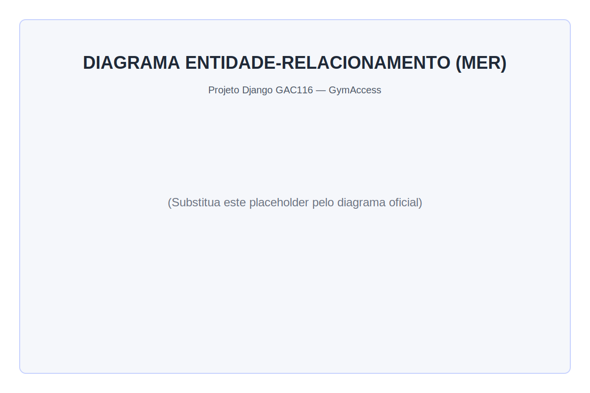

# GymAccess — Sistema de Gerenciamento de Rede de Academias

Projeto desenvolvido para a disciplina **GAC116 - Programação Web (2026/1)** utilizando o framework Django.

## Descrição

O GymAccess é um sistema web para gerenciamento de uma rede de academias. O sistema permite o cadastro de alunos via reconhecimento facial, vinculando-os a uma ou mais academias. O acesso (check-in) é liberado automaticamente por meio de reconhecimento facial via endpoint público dedicado a cada academia.

Cada academia possui um gestor responsável, que gerencia os alunos, planos e matrículas de sua unidade. O controle administrativo é realizado via painel Django Admin.

## Funcionalidades

- Cadastro de alunos com encoding facial gerado automaticamente ao salvar a foto
- Check-in por reconhecimento facial via endpoint POST por academia
- Painel administrativo para gestores (Django Admin)
- Controle de planos com limite de check-ins diários por academia
- Suporte a múltiplas academias com gestores independentes

## Modelagem de Dados

### Diagrama MER



### Entidades e Relacionamentos

```
SuperAdmin
    └── gerencia Academias e Gestores via Django Admin

Gestor (User — grupo: Gestores)
    └── acesso ao Django Admin restrito à sua Academia
    └── CRUD: Aluno, Plano, Matricula

Aluno (User + AlunoPerfil)
    └── check-in via reconhecimento facial (endpoint público)

Academia ──(1:1)──── Gestor
Academia ──(1:N)──── Plano
Academia ──(N:N)──── Aluno  [via Matricula]
Matricula ──(N:1)─── Plano
Acesso ──(N:1)────── Aluno
Acesso ──(N:1)────── Academia
```

### Tabelas

| Tabela | Campos principais |
|--------|-------------------|
| `User` | id, email, password, first_name, last_name *(Django built-in)* |
| `AlunoPerfil` | id, user (FK), cpf, telefone, data_nascimento, foto, face_encoding |
| `Academia` | id, nome, cnpj, endereco, gestor (FK User), ativa |
| `Plano` | id, academia (FK), nome, max_checkins_dia, valor |
| `Matricula` | id, aluno (FK User), academia (FK), plano (FK), data_inicio, data_fim, ativa |
| `Acesso` | id, aluno (FK), academia (FK), timestamp, status, confianca |

### Regras de Negócio

- Um aluno pode estar matriculado em mais de uma academia, com planos distintos por academia
- O plano define o número máximo de check-ins permitidos por dia naquela academia
- Cada academia possui exatamente um gestor
- O check-in é realizado via reconhecimento facial em endpoint público, sem necessidade de login
- O status do acesso pode ser: `LIBERADO`, `NEGADO` ou `DESCONHECIDO`

## Painel Administrativo (Django Admin)

O sistema possui dois níveis de acesso ao painel `/admin`:

### Superadmin
Acesso total ao sistema. Responsável por:
- Cadastrar academias e atribuir gestores
- Gerenciar todos os usuários, planos, matrículas e acessos
- Criar o grupo `Gestores` (criado automaticamente via migration)

### Gestor
Acesso restrito à sua academia. Criado pelo superadmin com `Staff status` ativo e adicionado ao grupo `Gestores`.

| Recurso | Pode ver | Pode adicionar | Pode editar | Pode excluir |
|---------|----------|----------------|-------------|--------------|
| Academias | Somente a sua | Não | Não | Não |
| Planos | Somente da sua academia | Sim | Sim | Sim |
| Matrículas | Somente da sua academia | Sim | Sim | Sim |
| Acessos | Somente da sua academia | Não | Não | Não |
| Usuários (alunos) | Somente matriculados na sua academia | Sim | Sim | Não |

> O grupo `Gestores` é criado automaticamente ao rodar `python manage.py migrate`. Para tornar um usuário gestor: marcar `Staff status` e adicionar ao grupo `Gestores` no painel admin.

## Tecnologias

| Tecnologia | Versão | Uso |
|------------|--------|-----|
| Python | 3.12 | Linguagem principal |
| Django | 6.x | Framework web |
| face_recognition | 1.x | Reconhecimento facial (dlib) |
| OpenCV | 4.x | Processamento de imagens |
| Pillow | 11.x | Manipulação de imagens (ImageField) |
| NumPy | 2.x | Serialização dos encodings faciais |
| PostgreSQL | 16 | Banco de dados (via Docker) |
| Docker | 28+ | Containerização do banco de dados |
| psycopg2-binary | 2.x | Driver Python para PostgreSQL |

## Pré-requisitos

```bash
# Dependências de sistema (Ubuntu/Debian)
sudo apt update
sudo apt install python3.12 python3.12-venv python3-dev cmake build-essential libopenblas-dev liblapack-dev

# Docker (necessário para o banco de dados)
docker --version
docker compose version
```

## Como Executar

```bash
# 1. Clonar repositório
git clone <url-do-repositorio>
cd projeto-django-GAC116

# 2. Criar e ativar ambiente virtual
python3 -m venv venv
source venv/bin/activate  # Linux/macOS
# venv\Scripts\activate   # Windows

# 3. Instalar setuptools compatível (necessário antes das demais dependências)
# setuptools >= 70 remove pkg_resources causando falha no face_recognition_models
pip install "setuptools<70"

# 4. Instalar modelos do face_recognition (deve vir antes do requirements.txt)
pip install git+https://github.com/ageitgey/face_recognition_models

# 5. Instalar demais dependências
# Atenção: face_recognition depende de dlib que compila C++ — pode demorar 5-10 min
pip install -r requirements.txt

# 6. Subir banco de dados PostgreSQL
docker compose -f docker/docker-compose.yml up -d

# 7. Aplicar migrações (cria tabelas e grupo Gestores automaticamente)
python manage.py migrate

# 8. Criar superusuário (acesso ao Django Admin)
python manage.py createsuperuser

# 9. Iniciar servidor
python manage.py runserver
```

Painel admin em `http://127.0.0.1:8000/admin`.

## Endpoint de Check-in

```
POST /academia/<id>/checkin/
Content-Type: application/json

{ "imagem": "<base64 JPEG>" }
```

Resposta:
```json
{ "status": "LIBERADO", "nome": "João Silva", "confianca": 78.3 }
{ "status": "NEGADO",   "nome": "João Silva", "confianca": 71.2 }
{ "status": "DESCONHECIDO", "nome": null,      "confianca": null }
```

## Banco de Dados

O projeto utiliza **PostgreSQL 16** via Docker. O arquivo `docker/docker-compose.yml` sobe o container automaticamente.

```bash
# Subir banco
docker compose -f docker/docker-compose.yml up -d

# Parar banco
docker compose -f docker/docker-compose.yml down

# Ver logs do banco
docker compose -f docker/docker-compose.yml logs db
```

Configuração de conexão (definida em `config/settings.py`):

| Parâmetro | Valor |
|-----------|-------|
| Host | localhost |
| Porta | 5432 |
| Banco | gymaccess |
| Usuário | gymaccess |
| Senha | gymaccess |

## Estrutura do Projeto

```
projeto-django-GAC116/
├── config/                     # Configurações do projeto Django
│   ├── settings.py
│   ├── urls.py
│   └── wsgi.py
├── core/                       # App principal
│   ├── models.py               # Modelos de dados
│   ├── admin.py                # Configuração do Django Admin
│   ├── views.py                # Endpoint de check-in
│   ├── tests.py                # Testes de funcionamento
│   ├── urls.py                 # Rotas da aplicação
│   ├── utils.py                # Lógica de reconhecimento facial
│   └── migrations/             # Migrações do banco de dados
├── docker/
│   └── docker-compose.yml      # PostgreSQL 16
├── RECONHECIMENTO_FACIAL.md    # Documentação técnica do reconhecimento facial
├── manage.py
└── requirements.txt
```

## Equipe

| Nome              | GitHub         |
|-------------------|----------------|
|Caio Souza         | caio-chs-ufla  |
|Leonardo Guimarães | leoguimaraes49 |
|Matheus Coutinho   | matheusfgcz    |
